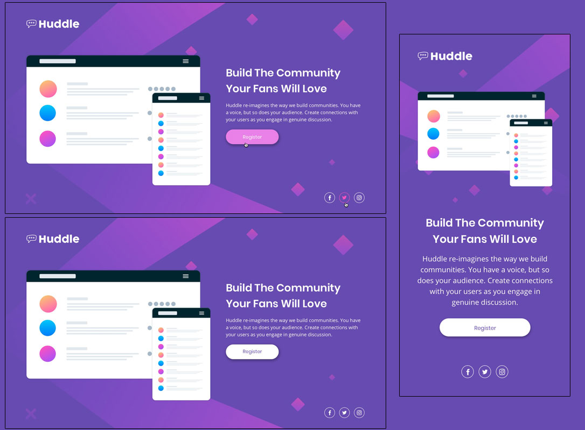

# [Frontend Mentor - FAQ Huddle landing page with a single introductory section Challenge](https://www.frontendmentor.io/challenges/huddle-landing-page-with-a-single-introductory-section-B_2Wvxgi0)

- ## [Deployed on Vercel](https://fm-huddle-landing-page-eta.vercel.app/)
- ## [GitHub Repository](https://github.com/panosjapan7/fm-huddle-landing-page)
- ## [My Frontend Mentor Profile](https://www.frontendmentor.io/profile/panosjapan7)
** **
- ### Built with
    - Semantic HTML5 markup
    - CSS
    - Flexbox
    - Mobile-first workflow

